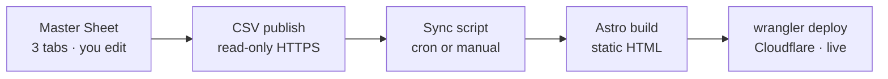

# Storys Web — Plan & Current State

> **Entry point for any AI tool (Claude Code, Codex, Antigravity) and for Johnson.**
> Read **Start Here** first to orient. Before finishing a session: update this file (Start Here + checkboxes + Decisions) and append an entry to `CHANGELOG.md`. Keep this file *current and small* — narrative history lives in `CHANGELOG.md`.

## Start Here
Storys (storys.fm) is a bilingual (zh / en) **Astro static site** for a Taiwanese podcast about brand founders, with an **interactive map** of the featured brands' physical stores. It's hosted on **Cloudflare Workers**.

- **Status:** LIVE **and fully SHIPPED (2026-08-23)** at https://storys-web.johnsonwang1010.workers.dev — the whole July backlog is pushed to origin AND deployed (blurbs reviewed by Johnson → rebase over 12 bot commits → push → safe-deploy checks → Johnson ran `wrangler deploy`; live site verified end-to-end incl. working forms). main == origin, working tree clean. Only `storys.fm` remains un-attached (domain registered outside Cloudflare — must be added to the CF account first).
- **Done through 2026-08-23 (all IN PRODUCTION):** the whole "Next 10" content stack — **51 reviewed episode blurbs** (`summaries` tab gid `2040068732`), **55 episode pages** with covers + Spotify/Apple embeds, **SEO/AEO** (sitemap/robots/canonical/OG + default 1200×630 OG card), **brands pipeline** (21 brands · 55 eps · **59 locations**), fresh **logos** (17 transparent + 4 flagged), **scroll-motion landing page**, **/visit** near-full-width, **IG reel cards**, and the **inbound-forms pipeline** (private "Storys Inbound" sheet + email notify — live endpoint verified in the deployed JS bundle).
- **Needs Johnson:** (a) fonts (Neue Kabel + 王漢宗特黑體繁) → design pass; (b) two flagged Locations rows (vacanza 信義新光三越 likely closed; nubra = 新光三越 A8 2F) — destructive edits, his call; (c) VA: re-do kure8/megan/vacanza/backerfounder logos (megan's missing PNG is the one validate warning); (d) get `storys.fm` into the Cloudflare account (registrar is external), then attach via Workers → storys-web → Domains & Routes; (e) delete 3 stale local branches (classifier blocks git branch-delete): `git branch -D feat/nextjs-migration backup-main-2026-08-11 snapshot-pre-push-2026-08-23` — all three verified superseded by main.
- **Remaining code lanes:** attach storys.fm · design/VIS pass when fonts land · Phase 2 leftovers (image optimization).
- **To regenerate:** brands `OUT="src/data/brands.generated.json" node scripts/sync.mjs` · summaries `node scripts/sync-summaries.mjs` · episodes `node scripts/sync-episodes.mjs` · reels `node scripts/sync-reels.mjs`. Edit the sheet, not the code — `brands.ts`, `episode-summaries.json`, `episodes.json`, `ig-reels.json` are generated.

## Key facts / handles (a fresh tool needs these)
- **Repo:** github.com/johnsonw1010/storys-web · branch `main`
- **Live URL:** https://storys-web.johnsonwang1010.workers.dev
- **Deploy is MANUAL:** `npm run build && npx wrangler@4 deploy` (or `npm run deploy`) from repo root. **`git push` does NOT deploy** (Workers Builds CI not wired yet).
  - Gotcha: large pushes over some networks need `git config http.postBuffer 524288000`.
- **Cloudflare:** account `johnsonwang1010@gmail.com` (wrangler OAuth-logged-in locally). Config in `wrangler.jsonc`; Astro uses `@astrojs/cloudflare`, `output: "hybrid"`.
- **Dev servers** (`.claude/launch.json`): Astro dev `npm run dev` → :4321 (HMR, the workshop); Wrangler preview `npm run preview` → :8787 (real Worker, dress rehearsal).
- **Content source today:** `src/data/brands.ts` (hardcoded, 20 brands) + `src/data/episodes.json` (52 eps, rich 16-field schema).
- **Master Sheet (Google):** `1axbM6qDG1pz1jCZ3_NyBZWtgcNbNb6cNtnou7FBI2P4` — tabs + **gids**: Episodes `0` · Locations `671058504` · Brands `2083068908`. `locations` now has a `kind` column. Owner johnson@yourbizvoice.com, shared "anyone with link → viewer". `brand_id` is the key linking all three tabs.
- **Episode sync:** `.github/workflows/sync-episodes.yml` (daily cron) → CSV → `episodes.json`. Still points at the OLD sheet `1aYKpPGqVYiUCG4Ky2p_bPwAhigAGRABdIPQ07d_num8` (Michelle's); Phase 1 repoints to the new one.
- **VA content folder (Drive):** "Website content" `1CKf-3GYS1V8UIe8NQeCxjKQLQCxJwSVf` → Master Sheet + `brand-logos/` (`1F_r8yBFLPXXVwsCGM4iN3fV3jtQSna1L`) + handoff doc + brands.csv/locations.csv.

## How content reaches the site
Build-time sync — **not** MCP, **not** live. Content is baked into static HTML at build time; deploy is manual today, so sheet edits are not instant. `brand_id` links the three tabs.

## Plan

### Phase 0 — Deploy ✅ DONE (2026-06-24)
- [x] Integrate git (29 episode-bot commits + Cloudflare config + logo commit); kept our rich episode schema (bot's was only 4 fields)
- [x] Build with `@astrojs/cloudflare`; push to `main`; deploy via `wrangler deploy`
- [x] Verify live — all pages 200, logos serving

### Phase 1 — Sheet-driven content pipeline ✅ DONE (built 07-02/03, shipped to prod 2026-08-23)
- [x] Repoint sync to the new Master Sheet; **pin tabs by `gid`**; parse by header name; normalize `brand_id` (trim + lowercase + typo map). *Verified 2026-08-23: fresh Master-Sheet regen is byte-identical to the cron's output — origin's daily cron has been syncing the right sheet all along.*
- [x] **Join + reshape** the 3 flat tabs into the site's *nested* `Brand[]` (`brands.generated.json` via `sync.mjs`; `brands.ts` keeps types/consts)
- [x] Coordinates: **entered by hand from Google Maps** in the sheet (geocoding retired); map stays Leaflet+OSM; pin-click → Google Maps
- [x] `kind` (store|hq) column in `locations`; hq filtered in map pins and /visit
- [x] Logos: `zhenfan`→`zhenfang` rename + redirect; transparent VA set in `public/brand/logos/`
- [x] Episode `brand_id` cleaned via typo map (blanks = discussion episodes, by design); `validate.mjs` guards it

### Phase 2 — Validate & polish 🔜
- [ ] Build-time validation (bad category, duplicate id, unresolved `brand_id`, **missing `cat.*` i18n key** → fail build with a clear message)
- [ ] Image optimization
- [ ] ⏸️ Auto-*deploy* deferred (keep the manual gate during migration). A **safe-deploy verification loop** exists now: `scripts/safe-deploy.sh` (build + `wrangler deploy --dry-run`, then human-confirmed deploy).
- [x] Inbound forms **code** (2026-07-03): Astro forms rewired + `src/lib/inbound{,-client}.ts` + `scripts/apps-script/inbound-forms.gs`, mock-verified end-to-end
- [x] Inbound forms **enablement** (2026-07-03): Apps Script deployed on the **private** "Storys Inbound" sheet, endpoint wired into `src/lib/inbound.ts`, verified end-to-end (3 form types → row + email). Live on next site deploy.
- [x] Default 1200×630 OG share card (2026-07-03) — `public/og/default.png`, source `docs/brand/og-card.html`; redo when fonts land
- [ ] Attach `storys.fm` custom domain

### Parallel A — Visual redesign "Editorial Luxury" 🎨 (proposed; mockups only, NOT built)
- [ ] Tier 1 slice: floating glass nav, editorial-split hero, serif type (Fraunces + Noto Serif TC), grain/glow, double-bezel cards, button-in-button CTA, scroll-reveal motion (~40–60k tokens)
- [ ] Tier 2: full home page · [ ] Tier 3: whole site
- ⚠️ Mockups were rendered in chat as previews. The live site still uses the **original** design. A "bolder" variant was also previewed.

### Parallel B — Content (VA, in progress)
- [ ] Logos: fresh **transparent, ≥800px** PNG for all 20 brands (replacing old small/solid-bg ones)
- [ ] Brands tab: review + add new
- [ ] Locations tab: every store per retail brand; `kind` blank for shops / `hq` for offices

## Decisions (newest at bottom)
- 2026-06-24 — **Hosting = Cloudflare Workers** (kept, not Pages — already working).
- 2026-06-24 — **Content model = Sheets-as-CMS** (one Google Sheet, 3 tabs). **No database** (D1 rejected — it would add an admin-UI build for no benefit). `brand_id` is the master key; episode key = `num` (no separate episode_id).
- 2026-06-24 — ~~Locations = hybrid: VA addresses + OSM Nominatim geocoding~~ — **superseded 2026-06-30** (geocoding retired; see below). Map stays Leaflet + OSM.
- 2026-06-24 — **Location display:** add `kind` (store|hq); HQ off the consumer map, shown on the brand page. Migrate 3 office rows to `hq`.
- 2026-06-24 — **Visual direction = "Editorial Luxury"** (keep forest/cream/orange; elevate type + texture + depth). Mockup-first before building.
- 2026-06-24 — **This journal = two files** (`PLAN.md` current + `CHANGELOG.md` history), split by mutability; entry via `CLAUDE.md` / `AGENTS.md`.
- 2026-06-25 — **Automation = Apps Script (Google side) + GitHub Actions (build/deploy); no n8n / no orchestrator** until a concrete multi-service need forces it. Same "stay lean" rule as no-database / no-admin-UI.
- 2026-06-30 — **Map/coords:** Leaflet+OSM display + Google Maps **click-through**; coordinates **entered by hand from Google Maps** (geocoding retired; lat/lng = source of truth). Avoids Google billing *and* the Nominatim step.
- 2026-06-30 — **Pipeline:** pin tabs by `gid`, parse by header name, normalize `brand_id`, validate at build time. The frontend needs the 3 flat tabs **joined into one nested `Brand[]`** (camelCase) — that join is Phase 1's core work.
- 2026-06-30 — **`kind` column** added to `locations`; tab renamed `location`→`locations`.
- 2026-06-30 — **Team photos** local in `public/team/{id}.jpg` (Johnson provides); not Drive.
- 2026-06-30 — **Obsidian hub** at `projects/storys/` (tag `#project/storys`) = operating checklist + journal; `PLAN.md`/`CHANGELOG.md` stay source-of-truth for *code* state.
- 2026-06-30 — **Loop engineering, selective:** safe-deploy `/goal` loop now (`scripts/safe-deploy.sh`); **writer ≠ checker** for generated content (draft cheap, check with Opus); **one loop at a time**. Content-loop / morning-intel / Hermes always-on deferred. (Research: vault `loop-engineering-hermes-obsidian-for-storys`.)
- 2026-07-02 — **Wire the brands pipeline LIVE now** — replace hardcoded `BRANDS` in `src/data/brands.ts` with `sync.mjs` output + `zhenfan`→`zhenfang` rename/redirect. Guardrails: branch snapshot, `validate.mjs`, count diff before ship. (Johnson authorized editing the protected path; shape proven lossless.)
- 2026-07-02 — **Brand voice = on-disk memory** `docs/brand/storys-brand-voice.md` (from the 11 approved blurbs + VIS); the writer→checker→human-gate loop reads it every run. (loop-eng Build 2.)
- 2026-07-02 — **SEO/AEO baseline:** hand-rolled prerendered `sitemap.xml` (no @astrojs/sitemap dep) + `robots.txt`; canonical + OpenGraph/Twitter centralized in `BaseLayout` (pages pass `canonical`/`ogType`/`ogImage` props). Origin sourced from `astro.config` `site`. ~~Default 1200×630 OG share card still owed~~ → shipped 2026-07-03.
- 2026-07-03 — **Backlog committed to local main** (6 feature commits) and **rebased over origin's 8 stale bot commits** (`-X theirs`, our Master-Sheet `episodes.json` wins). Push + deploy remain Johnson-gated via `scripts/safe-deploy.sh`.
- 2026-07-03 — **Inbound forms defaults** (per plan's open questions): separate **"Storys Inbound"** sheet (not the Master Sheet); **honeypot only** (Turnstile later if spam appears); transport = urlencoded POST (**simple CORS request** — Apps Script can't answer preflight, don't switch to JSON); endpoint/secret live in `src/lib/inbound.ts`; while unconfigured, forms show an honest bilingual error (never a fake success). `NOTIFY_EMAIL`/`CONTACT_EMAIL` = Johnson's call.
- 2026-07-03 — **Default OG card** rendered from `docs/brand/og-card.html` (official STORYS dark tagline lockup on deep forest, double-bezel, orange accent) → `public/og/default.png`; `BaseLayout` defaults `ogImage` to it, episode pages keep their covers.
- 2026-08-23 — **SHIPPED.** Blurbs reviewed → rebased over origin's 12 bot commits (`-X theirs`) → pushed → safe-deploy checks green → Johnson ran `wrangler deploy`. Live site verified end-to-end (pages 200, forms endpoint in deployed bundle, OG/sitemap/robots serving). **"Old sheet cron" warning retired** — regen from the Master Sheet was byte-identical to the cron's commits, so origin's cron was already on the right sheet; the OLD Michelle sheet is now safe to retire (Johnson's call).

## Risks / known issues
- Deploys are manual — easy to forget; the live site lags `main` until someone runs `wrangler deploy`. (As of 2026-08-23 they are in sync.)
- The daily episode cron commits to origin — **pull/rebase before local work** after any gap, or local main falls behind again.
- 4 logos still owed by the VA (kure8/megan/vacanza/backerfounder); megan has **no PNG at all** (the standing validate warning).
- Two Locations rows flagged for correction (vacanza 信義新光三越 likely closed; nubra = 新光三越 A8 2F) — Johnson's call, destructive sheet edits.
- **Pull tabs by `gid`, not name** — a tab rename silently made name-based fetch return the wrong tab. gids are rename-proof.
- OLD Michelle sheet (`1aYKp…`) is now retirable (cron verified on the Master Sheet 2026-08-23) — but deletion is Johnson's call.

## Conventions
- **Update at session end:** refresh Start Here + checkboxes + Decisions here; append one entry to `CHANGELOG.md`.
- **Changelog entries** capture the *why* (intent, decisions, open questions) and link commits — **don't relist files; git already has those.**
- **Major** = feature / decision / deploy. **Minor** = fix / copy / refactor.

## Pointers
- VA handoff brief + import CSVs: `docs/va-handoff/`
- Inbound forms plan (not built): `docs/plans/inbound-forms.md`
- Partner/sponsor showcase plan (not built; sponsor tiers deferred): `docs/plans/partner-showcase.md`
- ⏳ TODO (Johnson asked to be reminded): re-create the VA handoff in **Traditional Chinese (zh-Hant)** — resolve the pending content edits + fill the contact/deadline blanks first.
- Episode pages: proposed click-to-expand panel (embedded Apple+Spotify right, brand-voiced summary left). Approach + brand tone under discussion — not locked.
- (If opened as an Obsidian vault, add `.obsidian/` to `.gitignore`.)
