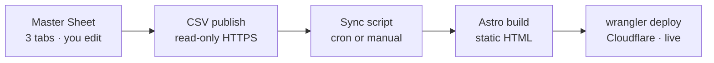

# Storys Web — Plan & Current State

> **Entry point for any AI tool (Claude Code, Codex, Antigravity) and for Johnson.**
> Read **Start Here** first to orient. Before finishing a session: update this file (Start Here + checkboxes + Decisions) and append an entry to `CHANGELOG.md`. Keep this file *current and small* — narrative history lives in `CHANGELOG.md`.

## Start Here
Storys (storys.fm) is a bilingual (zh / en) **Astro static site** for a Taiwanese podcast about brand founders, with an **interactive map** of the featured brands' physical stores. It's hosted on **Cloudflare Workers**.

- **Status:** LIVE at https://storys-web.johnsonwang1010.workers.dev (custom domain `storys.fm` not attached yet).
- **Current phase:** Phase 1 (make the site read content from the Google "Master Sheet" instead of hardcoded data) — *not started; waiting on the VA to populate the sheet.*
- **Single most important next action:** decide whether to build the "Editorial Luxury" visual redesign (Tier 1 slice); and when the sheet is populated, wire the Phase 1 sync pipeline.

## Key facts / handles (a fresh tool needs these)
- **Repo:** github.com/johnsonw1010/storys-web · branch `main`
- **Live URL:** https://storys-web.johnsonwang1010.workers.dev
- **Deploy is MANUAL:** `npm run build && npx wrangler@4 deploy` (or `npm run deploy`) from repo root. **`git push` does NOT deploy** (Workers Builds CI not wired yet).
  - Gotcha: large pushes over some networks need `git config http.postBuffer 524288000`.
- **Cloudflare:** account `johnsonwang1010@gmail.com` (wrangler OAuth-logged-in locally). Config in `wrangler.jsonc`; Astro uses `@astrojs/cloudflare`, `output: "hybrid"`.
- **Dev servers** (`.claude/launch.json`): Astro dev `npm run dev` → :4321 (HMR, the workshop); Wrangler preview `npm run preview` → :8787 (real Worker, dress rehearsal).
- **Content source today:** `src/data/brands.ts` (hardcoded, 20 brands) + `src/data/episodes.json` (52 eps, rich 16-field schema).
- **Master Sheet (Google):** `1axbM6qDG1pz1jCZ3_NyBZWtgcNbNb6cNtnou7FBI2P4` — tabs `Episodes` / `brands` / `locations`. Owner johnson@yourbizvoice.com, shared "anyone with link → viewer". `brand_id` is the key linking all three tabs.
- **Episode sync:** `.github/workflows/sync-episodes.yml` (daily cron) → CSV → `episodes.json`. Still points at the OLD sheet `1aYKpPGqVYiUCG4Ky2p_bPwAhigAGRABdIPQ07d_num8` (Michelle's); Phase 1 repoints to the new one.
- **VA content folder (Drive):** "Website content" `1CKf-3GYS1V8UIe8NQeCxjKQLQCxJwSVf` → Master Sheet + `brand-logos/` (`1F_r8yBFLPXXVwsCGM4iN3fV3jtQSna1L`) + handoff doc + brands.csv/locations.csv.

## How content reaches the site
Build-time sync — **not** MCP, **not** live. Content is baked into static HTML at build time; deploy is manual today, so sheet edits are not instant. `brand_id` links the three tabs.

## Plan

### Phase 0 — Deploy ✅ DONE (2026-06-24)
- [x] Integrate git (29 episode-bot commits + Cloudflare config + logo commit); kept our rich episode schema (bot's was only 4 fields)
- [x] Build with `@astrojs/cloudflare`; push to `main`; deploy via `wrangler deploy`
- [x] Verify live — all pages 200, logos serving

### Phase 1 — Sheet-driven content pipeline ⏳ (needs the VA sheet populated)
- [ ] Repoint sync to the new Master Sheet id; **parse by header name** (not column position); trim + lowercase `brand_id`
- [ ] Generate brands + locations from the sheet; retire hardcoded `brands.ts`; brand pages auto-pull episodes by `brand_id`
- [ ] Geocode addresses → lat/lng via **OpenStreetMap Nominatim** (free, no Google billing); cache + spot-check
- [ ] Implement `kind` field (`store` default | `hq`): pin shows iff `brand.type==='retail'` AND `kind!=='hq'`; HQ shown on brand page only. **Fix `visit.astro` to use the first non-hq location, not `locations[0]`**
- [ ] Swap in the new transparent logos; derive `has_logo` from file existence; rename `zhenfan` → `zhenfang`
- [ ] Clean episode `brand_id` issues (typo `backfounder`→`backerfounder` EP15; EP47 keyed `soft savant skill` vs brand `megan`; blank `brand_id` on discussion episodes)
- [ ] Derive episode `type` / `part_no` from titles

### Phase 2 — Validate & polish 🔜
- [ ] Build-time validation (bad category, duplicate id, unresolved `brand_id` → fail build with a clear message)
- [ ] Image optimization
- [ ] Auto-deploy: GitHub Action running `wrangler deploy` (or connect Workers Builds) so `git push` ships
- [ ] Replace dead Netlify forms with Google-backed inbound (Apps Script → Sheet + email) — plan in `docs/plans/inbound-forms.md`
- [ ] Attach `storys.fm` custom domain

### Parallel A — Visual redesign "Editorial Luxury" 🎨 (proposed; mockups only, NOT built)
- [ ] Tier 1 slice: floating glass nav, editorial-split hero, serif type (Fraunces + Noto Serif TC), grain/glow, double-bezel cards, button-in-button CTA, scroll-reveal motion (~40–60k tokens)
- [ ] Tier 2: full home page · [ ] Tier 3: whole site
- ⚠️ Mockups were rendered in chat as previews. The live site still uses the **original** design. A "bolder" variant was also previewed.

### Parallel B — Content (VA, in progress)
- [ ] Logos: fresh **transparent, ≥800px** PNG for all 20 brands (replacing old small/solid-bg ones)
- [ ] Brands tab: review + add new
- [ ] Locations tab: every store per retail brand; `kind` blank for shops / `hq` for offices

## Decisions (newest at bottom)
- 2026-06-24 — **Hosting = Cloudflare Workers** (kept, not Pages — already working).
- 2026-06-24 — **Content model = Sheets-as-CMS** (one Google Sheet, 3 tabs). **No database** (D1 rejected — it would add an admin-UI build for no benefit). `brand_id` is the master key; episode key = `num` (no separate episode_id).
- 2026-06-24 — **Locations = hybrid:** VA collects addresses; geocode via OSM Nominatim (free); map = Leaflet + OSM tiles. No Google Maps scraping (ToS).
- 2026-06-24 — **Location display:** add `kind` (store|hq); HQ off the consumer map, shown on the brand page. Migrate 3 office rows to `hq`.
- 2026-06-24 — **Visual direction = "Editorial Luxury"** (keep forest/cream/orange; elevate type + texture + depth). Mockup-first before building.
- 2026-06-24 — **This journal = two files** (`PLAN.md` current + `CHANGELOG.md` history), split by mutability; entry via `CLAUDE.md` / `AGENTS.md`.

## Risks / known issues
- 🔴 Contact / sponsor / application forms are **inert** — still Netlify Forms markup on a Cloudflare host, so submissions go nowhere. Plan to fix: `docs/plans/inbound-forms.md`.
- Deploys are manual — easy to forget; the live site lags `main` until someone runs `wrangler deploy`.
- Episode `brand_id` values in the sheet are inconsistent (case / spaces / typos / blanks) — must be normalized in Phase 1 or episodes won't link to their brand.
- `zhenfan` (old id / existing logo file) vs `zhenfang` (new sheet id) — rename needed.
- Old logos are low quality (small, solid background) — being fully replaced by the VA.
- Do NOT delete the OLD Michelle sheet (`1aYKp…`) until the sync is repointed to the new one and a build is verified.

## Conventions
- **Update at session end:** refresh Start Here + checkboxes + Decisions here; append one entry to `CHANGELOG.md`.
- **Changelog entries** capture the *why* (intent, decisions, open questions) and link commits — **don't relist files; git already has those.**
- **Major** = feature / decision / deploy. **Minor** = fix / copy / refactor.

## Pointers
- VA handoff brief + import CSVs: `docs/va-handoff/`
- Inbound forms plan (not built): `docs/plans/inbound-forms.md`
- Partner/sponsor showcase plan (not built; sponsor tiers deferred): `docs/plans/partner-showcase.md`
- ⏳ TODO (Johnson asked to be reminded): re-create the VA handoff in **Traditional Chinese (zh-Hant)** — resolve the pending content edits + fill the contact/deadline blanks first.
- Episode pages: proposed click-to-expand panel (embedded Apple+Spotify right, brand-voiced summary left). Approach + brand tone under discussion — not locked.
- (If opened as an Obsidian vault, add `.obsidian/` to `.gitignore`.)
