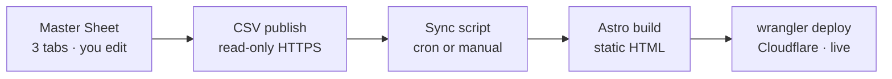

# Storys Web — Plan & Current State

> **Entry point for any AI tool (Claude Code, Codex, Antigravity) and for Johnson.**
> Read **Start Here** first to orient. Before finishing a session: update this file (Start Here + checkboxes + Decisions) and append an entry to `CHANGELOG.md`. Keep this file *current and small* — narrative history lives in `CHANGELOG.md`.

## Start Here
Storys (storys.fm) is a bilingual (zh / en) **Astro static site** for a Taiwanese podcast about brand founders, with an **interactive map** of the featured brands' physical stores. It's hosted on **Cloudflare Workers**.

- **Status:** LIVE at https://storys-web.johnsonwang1010.workers.dev (custom domain `storys.fm` not attached yet). **A large body of uncommitted local work is ahead of the live site — nothing committed, nothing deployed.** First acts of a new session: consider `git add`-ing the generated JSONs together with code (build breaks on fresh clone otherwise), and plan the deploy.
- **Done through 2026-07-03 (all local, all review-gated):** the whole "Next 10" content stack — **51 episode blurbs** (writer→checker loop; `summaries` tab gid `2040068732`), **55 episode pages** with covers + Spotify/Apple embeds, **SEO/AEO** (sitemap/robots/canonical/OG), **brands pipeline LIVE** (21 brands · 54 eps · **57 locations** from the Claude-backfilled Locations tab), fresh **logos** (17 transparent + 4 flagged), **scroll-motion landing page**, **/visit** near-full-width, **Instagram**: 347 posts scraped → `instagram` tab (gid `48841711`, likes/comments/plays for analysis) → **reel cards on episode pages** (video-aspect card + cover facade + chrome-less playback; final design Johnson-approved on ep39).
- **Needs Johnson:** (a) **review 51 blurbs** in the `summaries` tab (human gate before deploy); (b) fonts (Neue Kabel + 王漢宗特黑體繁) → design pass (#6); (c) two flagged Locations rows (vacanza 信義新光三越 likely closed; nubra = 新光三越 A8 2F) — destructive edits, his call; (d) VA: re-do kure8/megan/vacanza/backerfounder logos.
- **Remaining code lanes:** commit + **#10 ship** (`scripts/safe-deploy.sh` → then attach storys.fm), dead-forms fix (#5, plan in `docs/plans/inbound-forms.md`), default 1200×630 OG share card, repoint the cron workflow (§5.2), design/VIS pass when fonts land.
- **To regenerate:** brands `OUT="src/data/brands.generated.json" node scripts/sync.mjs` · summaries `node scripts/sync-summaries.mjs` · episodes `node scripts/sync-episodes.mjs` · reels `node scripts/sync-reels.mjs`. Edit the sheet, not the code — `brands.ts`, `episode-summaries.json`, `episodes.json`, `ig-reels.json` are generated.

## Key facts / handles (a fresh tool needs these)
- **Repo:** github.com/johnsonw1010/storys-web · branch `main`
- **Live URL:** https://storys-web.johnsonwang1010.workers.dev
- **Deploy is MANUAL:** `npm run build && npx wrangler@4 deploy` (or `npm run deploy`) from repo root. **`git push` does NOT deploy** (Workers Builds CI not wired yet).
  - Gotcha: large pushes over some networks need `git config http.postBuffer 524288000`.
- **Cloudflare:** account `johnsonwang1010@gmail.com` (wrangler OAuth-logged-in locally). Config in `wrangler.jsonc`; Astro uses `@astrojs/cloudflare`, `output: "hybrid"`.
- **Dev servers** (`.claude/launch.json`): Astro dev `npm run dev` → :4321 (HMR, the workshop); Wrangler preview `npm run preview` → :8787 (real Worker, dress rehearsal).
- **Content source today:** `src/data/brands.ts` (hardcoded, 20 brands) + `src/data/episodes.json` (52 eps, rich 16-field schema).
- **Master Sheet (Google):** `1axbM6qDG1pz1jCZ3_NyBZWtgcNbNb6cNtnou7FBI2P4` — tabs + **gids**: Episodes `0` · Locations `671058504` · Brands `2083068908`. `locations` now has a `kind` column. Owner johnson@yourbizvoice.com, shared "anyone with link → viewer". `brand_id` is the key linking all three tabs.
- **Episode sync:** `.github/workflows/sync-episodes.yml` (daily cron) → CSV → `episodes.json`. Still points at the OLD sheet `1aYKpPGqVYiUCG4Ky2p_bPwAhigAGRABdIPQ07d_num8` (Michelle's); Phase 1 repoints to the new one.
- **VA content folder (Drive):** "Website content" `1CKf-3GYS1V8UIe8NQeCxjKQLQCxJwSVf` → Master Sheet + `brand-logos/` (`1F_r8yBFLPXXVwsCGM4iN3fV3jtQSna1L`) + handoff doc + brands.csv/locations.csv.

## How content reaches the site
Build-time sync — **not** MCP, **not** live. Content is baked into static HTML at build time; deploy is manual today, so sheet edits are not instant. `brand_id` links the three tabs.

## Plan

### Phase 0 — Deploy ✅ DONE (2026-06-24)
- [x] Integrate git (29 episode-bot commits + Cloudflare config + logo commit); kept our rich episode schema (bot's was only 4 fields)
- [x] Build with `@astrojs/cloudflare`; push to `main`; deploy via `wrangler deploy`
- [x] Verify live — all pages 200, logos serving

### Phase 1 — Sheet-driven content pipeline ⏳ (needs the VA sheet populated)
- [ ] Repoint sync to the new Master Sheet; **pin tabs by `gid`** (name-based proved fragile — a rename silently returned the wrong tab); parse by header name; normalize `brand_id` (trim + lowercase + typo map)
- [ ] **Join + reshape** the 3 flat tabs into the site's *nested* `Brand[]` (episodes + locations embedded per brand, camelCase: `name_zh→nameZh`, `gmaps_url→gmaps`, `has_logo→logo`). Keep `brands.ts` types/consts/`brandLogoUrl`; replace only the `BRANDS` array with generated data. **This is the real Phase-1 work** — de-risk one brand end-to-end first.
- [ ] Coordinates: **entered by hand from Google Maps** in the sheet (geocoding retired); map stays Leaflet+OSM; pin-click → Google Maps
- [ ] `kind` (store|hq) column added to `locations`; pin shows iff `type==='retail'` AND `kind!=='hq'`; filter hq in **both** `map.astro` (pin loop) **and** `visit.astro` (first non-hq location, handle all-hq case)
- [ ] Logos: rename `zhenfan`→`zhenfang` (+ `/brands/zhenfan` redirect); copy Drive→`public/brand/logos/`; derive `has_logo`/`logo` from file existence
- [ ] Clean episode `brand_id` (typo `backfounder`→`backerfounder`; EP47 `soft savant skill`→`megan`; 22 blank on discussion episodes); derive episode `type`/`part_no` from titles

### Phase 2 — Validate & polish 🔜
- [ ] Build-time validation (bad category, duplicate id, unresolved `brand_id`, **missing `cat.*` i18n key** → fail build with a clear message)
- [ ] Image optimization
- [ ] ⏸️ Auto-*deploy* deferred (keep the manual gate during migration). A **safe-deploy verification loop** exists now: `scripts/safe-deploy.sh` (build + `wrangler deploy --dry-run`, then human-confirmed deploy).
- [ ] Replace dead Netlify forms with Google-backed inbound (Apps Script → Sheet + email) — plan in `docs/plans/inbound-forms.md`
- [ ] Attach `storys.fm` custom domain

### Parallel A — Visual redesign "Editorial Luxury" 🎨 (proposed; mockups only, NOT built)
- [ ] Tier 1 slice: floating glass nav, editorial-split hero, serif type (Fraunces + Noto Serif TC), grain/glow, double-bezel cards, button-in-button CTA, scroll-reveal motion (~40–60k tokens)
- [ ] Tier 2: full home page · [ ] Tier 3: whole site
- ⚠️ Mockups were rendered in chat as previews. The live site still uses the **original** design. A "bolder" variant was also previewed.

### Parallel B — Content (VA, in progress)
- [ ] Logos: fresh **transparent, ≥800px** PNG for all 20 brands (replacing old small/solid-bg ones)
- [ ] Brands tab: review + add new
- [ ] Locations tab: every store per retail brand; `kind` blank for shops / `hq` for offices

## Decisions (newest at bottom)
- 2026-06-24 — **Hosting = Cloudflare Workers** (kept, not Pages — already working).
- 2026-06-24 — **Content model = Sheets-as-CMS** (one Google Sheet, 3 tabs). **No database** (D1 rejected — it would add an admin-UI build for no benefit). `brand_id` is the master key; episode key = `num` (no separate episode_id).
- 2026-06-24 — ~~Locations = hybrid: VA addresses + OSM Nominatim geocoding~~ — **superseded 2026-06-30** (geocoding retired; see below). Map stays Leaflet + OSM.
- 2026-06-24 — **Location display:** add `kind` (store|hq); HQ off the consumer map, shown on the brand page. Migrate 3 office rows to `hq`.
- 2026-06-24 — **Visual direction = "Editorial Luxury"** (keep forest/cream/orange; elevate type + texture + depth). Mockup-first before building.
- 2026-06-24 — **This journal = two files** (`PLAN.md` current + `CHANGELOG.md` history), split by mutability; entry via `CLAUDE.md` / `AGENTS.md`.
- 2026-06-25 — **Automation = Apps Script (Google side) + GitHub Actions (build/deploy); no n8n / no orchestrator** until a concrete multi-service need forces it. Same "stay lean" rule as no-database / no-admin-UI.
- 2026-06-30 — **Map/coords:** Leaflet+OSM display + Google Maps **click-through**; coordinates **entered by hand from Google Maps** (geocoding retired; lat/lng = source of truth). Avoids Google billing *and* the Nominatim step.
- 2026-06-30 — **Pipeline:** pin tabs by `gid`, parse by header name, normalize `brand_id`, validate at build time. The frontend needs the 3 flat tabs **joined into one nested `Brand[]`** (camelCase) — that join is Phase 1's core work.
- 2026-06-30 — **`kind` column** added to `locations`; tab renamed `location`→`locations`.
- 2026-06-30 — **Team photos** local in `public/team/{id}.jpg` (Johnson provides); not Drive.
- 2026-06-30 — **Obsidian hub** at `projects/storys/` (tag `#project/storys`) = operating checklist + journal; `PLAN.md`/`CHANGELOG.md` stay source-of-truth for *code* state.
- 2026-06-30 — **Loop engineering, selective:** safe-deploy `/goal` loop now (`scripts/safe-deploy.sh`); **writer ≠ checker** for generated content (draft cheap, check with Opus); **one loop at a time**. Content-loop / morning-intel / Hermes always-on deferred. (Research: vault `loop-engineering-hermes-obsidian-for-storys`.)
- 2026-07-02 — **Wire the brands pipeline LIVE now** — replace hardcoded `BRANDS` in `src/data/brands.ts` with `sync.mjs` output + `zhenfan`→`zhenfang` rename/redirect. Guardrails: branch snapshot, `validate.mjs`, count diff before ship. (Johnson authorized editing the protected path; shape proven lossless.)
- 2026-07-02 — **Brand voice = on-disk memory** `docs/brand/storys-brand-voice.md` (from the 11 approved blurbs + VIS); the writer→checker→human-gate loop reads it every run. (loop-eng Build 2.)
- 2026-07-02 — **SEO/AEO baseline:** hand-rolled prerendered `sitemap.xml` (no @astrojs/sitemap dep) + `robots.txt`; canonical + OpenGraph/Twitter centralized in `BaseLayout` (pages pass `canonical`/`ogType`/`ogImage` props). Origin sourced from `astro.config` `site`. Default 1200×630 OG share card still owed.

## Risks / known issues
- 🔴 Contact / sponsor / application forms are **inert** — still Netlify Forms markup on a Cloudflare host, so submissions go nowhere. Plan to fix: `docs/plans/inbound-forms.md`.
- Deploys are manual — easy to forget; the live site lags `main` until someone runs `wrangler deploy`.
- Episode `brand_id` values in the sheet are inconsistent (case / spaces / typos / blanks) — must be normalized in Phase 1 or episodes won't link to their brand.
- `zhenfan` (old id / existing logo file) vs `zhenfang` (new sheet id) — rename needed (+ redirect the live `/brands/zhenfan` path).
- **Frontend consumes a *nested* `Brand[]`** (episodes + locations embedded per brand, camelCase). The 3 sheet tabs are flat — the sync must **join + reshape**, not just emit 3 JSON files. Easy to underestimate.
- **Pull tabs by `gid`, not name** — a tab rename (`location`→`locations`) silently made name-based fetch return the wrong tab. gids are rename-proof.
- Old logos are low quality (small, solid background) — being fully replaced by the VA.
- Do NOT delete the OLD Michelle sheet (`1aYKp…`) until the sync is repointed to the new one and a build is verified.

## Conventions
- **Update at session end:** refresh Start Here + checkboxes + Decisions here; append one entry to `CHANGELOG.md`.
- **Changelog entries** capture the *why* (intent, decisions, open questions) and link commits — **don't relist files; git already has those.**
- **Major** = feature / decision / deploy. **Minor** = fix / copy / refactor.

## Pointers
- VA handoff brief + import CSVs: `docs/va-handoff/`
- Inbound forms plan (not built): `docs/plans/inbound-forms.md`
- Partner/sponsor showcase plan (not built; sponsor tiers deferred): `docs/plans/partner-showcase.md`
- ⏳ TODO (Johnson asked to be reminded): re-create the VA handoff in **Traditional Chinese (zh-Hant)** — resolve the pending content edits + fill the contact/deadline blanks first.
- Episode pages: proposed click-to-expand panel (embedded Apple+Spotify right, brand-voiced summary left). Approach + brand tone under discussion — not locked.
- (If opened as an Obsidian vault, add `.obsidian/` to `.gitignore`.)
